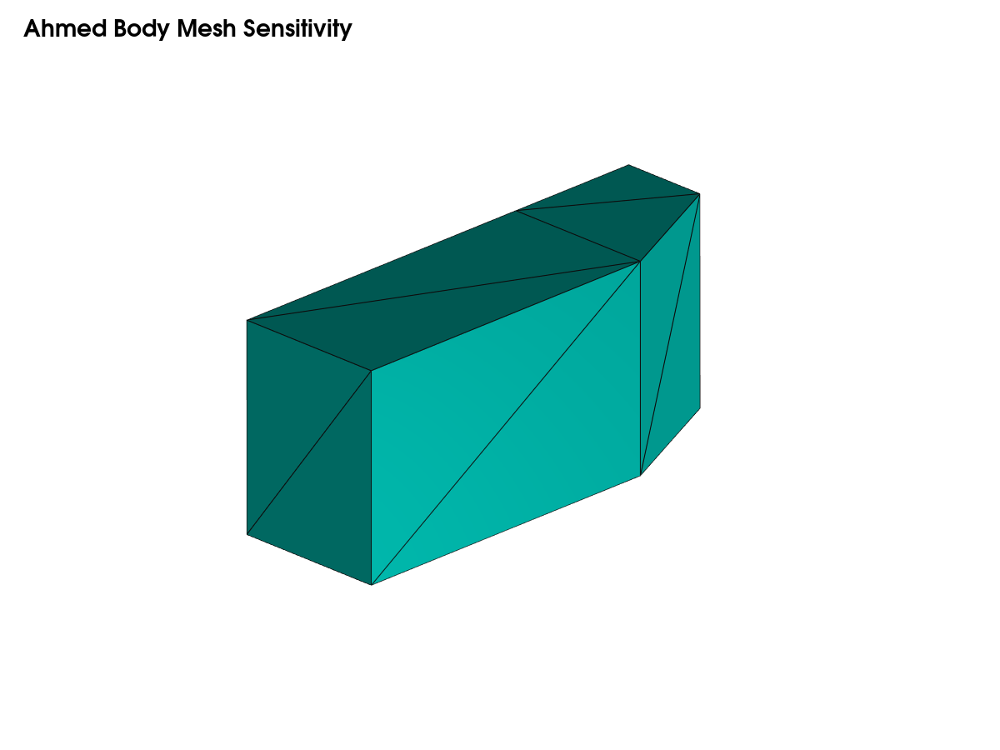
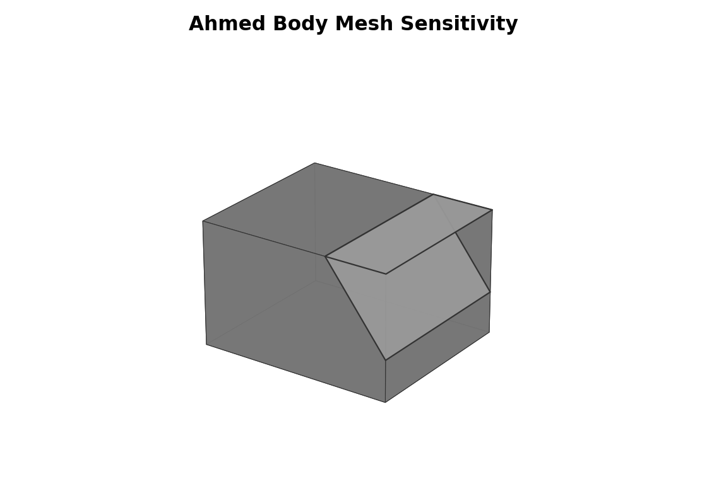

# Ahmed Body Mesh Sensitivity

**Case ID:** `mesh_sensitivity`  
**Solver target:** `simpleFoam`  
**Status:** planned / literature-backed

Geometry source: [`geometry/model.stl`](geometry/model.stl).

## Purpose

Coarse/medium/fine mesh comparison for drag and wake stability.

## Results

Numerical results are not generated yet. This case is a planned public case
with literature basis documented at repository level.

## Usage

See [USAGE.md](USAGE.md).
